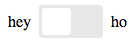

# ember-cli-toggle

Checkbox based Toggle Switch component for Ember.
Based on [this](http://codepen.io/mallendeo/pen/eLIiG/) codepen.  
Here's the official [demo] using this component.

[![NPM][npm-badge]][npm-badge-url]  
[![Build Status][travis-badge]][travis-badge-url]
[![Ember Observer Score][ember-observer-badge]][ember-observer-url]

## Usage

First install with `ember install ember-cli-toggle`, and add one of the following
in your template:

```hbs
{{x-toggle toggle='startCar'}}
{{x-toggle theme='light' toggle='enableLayer'}}
{{x-toggle theme='ios' size='small' toggle='muteVolume'}}
{{x-toggle theme='flat' toggle='disableTest'}}
{{x-toggle theme='flip' off='Nope' on='Yep' toggle='haveFun'}}
{{x-toggle theme='skewed' size='large' toggle='enablePartyMode'}}
```

#### Labels
You can also show text labels on either side of toggle switch with:
````hbs
{{x-toggle showLabels=true off='Hey' on='Ho' toggle='letsGo'}}
````
Which would look like (using "default" theme):



This option is available on all themes but is a less sensible choice for those themes which actually
include the label within the control (e.g., `skew` and `flip`).

#### Binding ####

It's perfectly normal to *not* need bindings for a toggle switch as the "toggle" property allows the container to catch thrown actions
which happen at each state transition. Sometimes, however, it's easier to just bind your toggle switch to a property on the container. This is possible with use of the `value` binding:

````hbs
{{x-toggle value=controller.heyOrHo showLabels=true off='Hey' on='Ho'}}
````

This will ensure that the bound property is always set to the *true* or *false* value and as it's a two way binding this will allow the toggle
control to automatically update its UI when the value is changed external to the component as well.

Finally, it is sometimes the case that rather than a *true* or *false* value the toggle is meant to move between two discrete, but non-boolean states.
In order to support this functionality there is an overloaded form of setting the `on` and `off` properties which not only sets a "label"
for the state but also a "value". In our "hey" versus "ho" example you might do the following:

````hbs
{{x-toggle value=controller.heyOrHo showLabels=true off='Hey:hey' on='Ho:ho'}}
````

With this configuration the "value" for the **on** state will be `hey` and in the **off** state it will be `ho`. If the bound property
is set to anything other than the two accepted value states it will reset to its "off state".

### Available Options

* `theme` - One of 'light', 'ios', 'flat', 'flip', 'skewed', 'default'.
            Defaults to 'default' if not specified.
* `size` -  One of 'small', 'medium', 'large'.
            Defaults to 'medium' if not specified.
* `on` - The label for the *on* state. Defaults to 'On'.
* `off` - The label for the *off* state. Defaults to 'Off'.
* `showLabels` - Defaults to 'false', if 'true' will display labels on left and ride side of toggle switch
* `toggle` - The toggle action, which has one argument e.g. `isToggled`.
* `toggled` - Defaults to `false`, meaning not enabled by default. When `true`, an `.x-toggle-container-checked` class is set on the component.
* `disabled` - Defaults to `false`, which means you can click the toggle.
  When `true`, an `.x-toggle-disabled` class is set on the toggle and an `.x-toggle-container-disabled` class is set on the component.

### Configuring

Add a configuration for `ember-cli-toggle` to include only the themes that
you will use.

```js
ENV['ember-cli-toggle'] = {
  includedThemes: ['light', 'default', 'flip'],
  excludedThemes: ['flip'],
  defaultShowLabels: true, // defaults to false
  defaultTheme: 'light',   // defaults to 'default'
  defaultSize: 'small',    // defaults to 'medium'
  defaultOff: 'False',     // defaults to 'Off'
  defaultOn: 'True'        // defaults to 'On'
};
```
> note: the IOS theme is referred to as just `ios` not `ios7` as was indicated in the originating CSS source

To exclude or not include a theme, means that it's css styles will not be bundled with
your application, thus not polluting your app.

_Note: Including a blank array e.g. `includeThemes: []` will not include any themes, leaving
you to define your own theme styles. See the `vendor/ember-cli-toggle/themes` directory
for reference._

## Contributing

Outlines how to begin contributing to this Ember-CLI project.

### Installation

* `git clone` this repository
* `npm install`
* `bower install`

### Running

* `ember server`
* Visit your app at http://localhost:4200.

### Running Tests

* `ember test`
* `ember test --server`

### Building

* `ember build`

For more information on using ember-cli, visit [http://www.ember-cli.com/](http://www.ember-cli.com/).

[npm-badge]: https://nodei.co/npm/ember-cli-toggle.png?downloads=true&stars=true
[npm-badge-url]: https://nodei.co/npm/ember-cli-toggle/
[travis-badge]: https://travis-ci.org/knownasilya/ember-cli-toggle.svg
[travis-badge-url]: https://travis-ci.org/knownasilya/ember-cli-toggle
[ember-observer-badge]: http://emberobserver.com/badges/ember-cli-toggle.svg
[ember-observer-url]: http://emberobserver.com/addons/ember-cli-toggle
[demo]: http://knownasilya.github.io/ember-cli-toggle/
