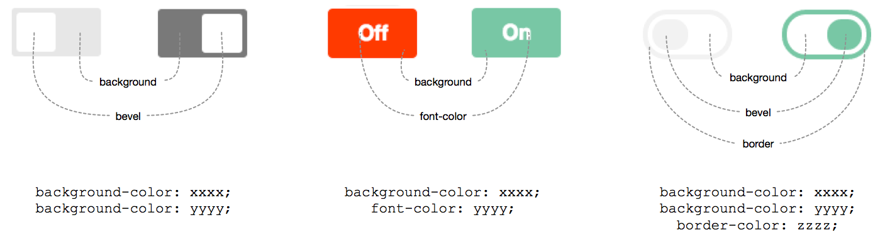

# ember-cli-toggle

Checkbox based Toggle Switch component for Ember.  
Based on [this](http://codepen.io/mallendeo/pen/eLIiG/) codepen.

[![NPM][npm-badge]][npm-badge-url]

## Usage

First install with `npm install --save-dev ember-cli-toggle`, and add one of the following
in your template:

```hbs
{{x-toggle toggle='startCar'}}
{{x-toggle theme='light' toggle='enableLayer'}}
{{x-toggle theme='ios' size='small' toggle='muteVolume'}}
{{x-toggle theme='flat' toggle='disableTest'}}
{{x-toggle theme='flip' off='Nope' on='Yep' toggle='haveFun'}}
{{x-toggle theme='skewed' size='large' toggle='enablePartyMode'}}
```

You can also show text labels on either side of toggle switch with: 
````hbs
{{x-toggle on='hey' off='ho' toggle='letsGo' showLabel='true'}}
````
Which would look like (using "default" theme): 


This option is available on all themes but is a less sensible choice for those themes which actually 
include the label within the control (e.g., `skew` and `flip`).

### Available Options

* `theme` - One of 'light', 'ios', 'flat', 'flip', 'skewed', 'default'. Defaults to 'default' if not specified.
* `size` -  One of 'small', 'medium', 'large'. Defaults to 'medium' if not specified.
* `on` - Defaults to 'On'.
* `off` - Defaults to 'Off'.
* `showLabels` - Defaults to 'false', if 'true' will display labels on left and ride side of toggle switch
* `colors` - either a hash or an array of values, if an array it is assumed to be of form [#onColor, #offColor]
* `toggle` - The toggle action, which has one argument e.g. `isToggled`.
* `toggled` - Defaults to `false`, meaning not enabled by default.

### Configuring

Add a configuration for `ember-cli-toggle` to include only the themes that
you will use.

```js
ENV['ember-cli-toggle'] = {
  includedThemes: ['light', 'default', 'flip'],
  excludedThemes: ['flip'],
  defaultTheme: 'light',  // defaults to 'default'
  defaultSize: 'small',   // defaults to 'medium'
  defaultOff: 'False',    // defaults to 'Off'
  defaultOn: 'True'       // defaults to 'On'
  colors: {
	bevelOn: 'lightgrey',
	bevelOff: 'darkgrey',
	fontOn: 'green'
  }
};
```
> note: the IOS theme is referred to as just `ios` not `ios7` as was indicated in the originating CSS source

To exclude or not include a theme, means that it's css styles will not be bundled with
your application, thus not polluting your app.

_Note: Including a blank array e.g. `includeThemes: []` will not include any themes, leaving
you to define your own theme styles. See the `vendor/ember-cli-toggle/themes` directory
for reference._

#### More on Colors ####


The colors (along with transitions between colors) are all done with CSS versus a Javascript driven solution like jQuery or Velocity. This is fine but does make providing a completely flexible color solution a bit more complicated. In order to provide the appropriate flexibility while maintaining the CSS simplicity we must understand the color requirements in a structured fashion: 

1. There are two states "on" and "off" which in CSS are represented as based on the existance or lack of the psuedo property `:checked` on the **label** property
1. There are multiple conceptual targets in the various themes which map to CSS properties but sometimes with overlap (e.g., both the bevel and the background use the CSS `background-color` property for their color settings)

So this leads to a design which behaves with the following constraints:

1. Color options are defined at *build time* not *run time*. This means there is not an unlimited set of choices but only those defined at build. Out of the box the color options are: `['none','white','black','green','yellow', 'red','grey','lightgrey','darkgrey']`. 
	> The colors included are a superset of the colors used in the current set of themes so that there is always the option of explicitly setting a theme to it's default characteristics
2. Themes will by default always behave as they are designed in CSS. If and when you override that behaviour you must do that explicitly based on the "state" (e.g., *on* or *off*) as well as the "target" (e.g., *background*, *bevel*, *font*, and *border*). So if for instance you wanted to use the flat theme but wanted the border to ALWAYS be *lightgrey* then you would would do this within a template like this:

	````hbs
	{{x-toggle theme="fixed" colorBevelOff="lightgrey" colorBevelOn="lightgrey"}}
	````

	or if you're into shorthand you could get away with just:

	````hbs
	{{x-toggle theme="fixed" colorBevelOn="lightgrey"}}
	````

	This is equivelent because the default color for the fixed theme's border is lightgrey.


[^background-color]: the background color also is synonymous with the border color unless explicitly differentiated 

## Contributing

Outlines how to begin contributing to this Ember-CLI project.

### Installation

* `git clone` this repository
* `npm install`
* `bower install`

### Running

* `ember server`
* Visit your app at http://localhost:4200.

### Running Tests

* `ember test`
* `ember test --server`

### Building

* `ember build`

For more information on using ember-cli, visit [http://www.ember-cli.com/](http://www.ember-cli.com/).

[npm-badge]: https://nodei.co/npm/ember-cli-toggle.png?downloads=true&stars=true
[npm-badge-url]: https://nodei.co/npm/ember-cli-toggle/
